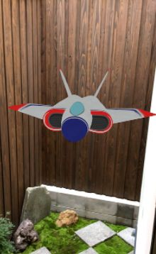

# 从零开始学习AR增强现实软件技术

## 前 言

你发现你掌握的技术，在网络能搜索到的是入门教程，能购买的图书也只是翻译了官方帮助文档。

你想跨专业学习技术，能搜索到的是专业术语、专业工具名称，却不知道这个技术的工作步骤和学习路线。

你想学习前沿的新技术，能搜索到的是抽象术语、没有学过的数学公式、含糊讲解的源代码。

## 目 录

## 1. 程序开发

1.1 变量类型和类型转换

1.2 流程控制

1.3 结构体和函数

1.4 接口和包

1.5 异常处理

1.6 字符串

1.7 日期

1.8 数组

1.9 哈希表

1.10 文件访问

1.11 网络请求

1.12 访问数据库

1.13 多线程

## 2. 3D开发

2.1 相机camera

2.2 场景scene

2.3 渲染器renderer

2.4 实体、组件、系统的Entity-Component-System模式

2.5 光照light

2.6 键盘、鼠标、触摸屏等用户交互

2.7 碰撞检测

## 3. AR开发

3.1 三行代码开发AR（入门示例）

```swift
// 程序窗口加载时
sceneView.scene = SCNScene(named: "ship.scn", inDirectory: "models.scnassets/ship")!
// 程序窗口显示时
sceneView.session.run(ARWorldTrackingConfiguration())
// 程序窗口隐藏时
sceneView.session.pause() 
```

三行代码开发AR的效果




3.2 将3D固定在图像上（图像跟踪）

3.3 将3D固定在平面上（环境理解）

3.4 选择现实环境感兴趣的位置（命中检测）

3.5 将3D固定在空间中（运动跟踪）

3.6 将3D固定在对象上（对象跟踪）

3.7 3D融入现实环境的光线（光照估测）

3.8 3D显示在真实物体的后面（虚实遮挡）

## 4. AI开发

4.1 将3D固定在人脸上

4.2 将3D固定在人体上

4.3 将3D固定在手指上

4.4 将3D固定在目标物体上

## 5. 例子开发

5.1 AR测量尺子

5.2 AR绘画涂鸦

5.3 AR和PBR渲染

5.4 AR和机器学习图像分类

5.5 AR和深度学习人脸特征点检测

## 6. 框架原理

6.1 ARKit（iOS的AR框架）

6.2 ARCore（Android的AR框架）

6.3 VINS-Mono（基于摄像头并融合惯性测量单元的AR框架）

6.4 ORB_SLAM（基于摄像头的AR框架）

## 7. 关联技术

7.1 机器人导航（同步定位和地图构建SLAM）

7.2 三维重建（从运动中恢复结构SFM）

7.3 全景图片拼接（图像配准）
